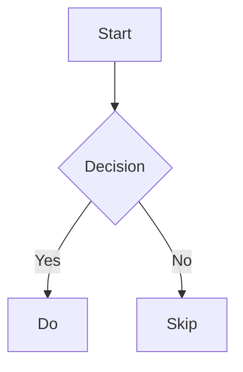

<div align="center">
  
  
  [](https://www.typescriptlang.org/)
  
  [](https://github.com/Nil369/aksha-md-editor/blob/main/LICENSE)
  [](https://aksha-md-editor-docs.akashhalder.in/)
  [](https://akashhalder.in/portfolio)

  <h1>Aksha MD Editor </h1>
  <p>A highly optimized, production-ready Markdown Editor for React with live preview and VS Code style interface</p>
</div>

---

## 📸 Preview

| Light theme | Dark Mode |  Features Demo |
| --- | --- | --- |
|  |  |  |

---

## ✨ Features

- **🎯 Monaco Editor Integration** - The same powerful editor that powers VS Code
- **📝 GitHub Flavored Markdown** - Full GFM support with tables, task lists, and more
- **🧮 Math Equations** - LaTeX syntax with KaTeX rendering (inline `$...$` and block `$$...$$`)
- **🎨 Syntax Highlighting** - Code blocks with 100+ language support
- **🌗 Theme Support** - Light, dark, and auto (system preference) themes
- **👁️ Multiple View Modes** - Edit-only, Preview-only, or Split view
- **⌨️ Keyboard Shortcuts** - Familiar shortcuts for productivity
- **🛠️ Rich Toolbar** - Comprehensive formatting options
- **📱 Responsive** - Works seamlessly on all screen sizes
- **⚡ Performance Optimized** - Debounced updates and efficient rendering
- **🎯 TypeScript** - Full type safety with comprehensive type definitions
- **📦 Tree-shakable** - Import only what you need

----

## 📖 Documentation

Complete guides, API reference, and examples are available in our documentation site: **[Visit the full documentation →](https://aksha-md-editor-docs.akashhalder.in/)**

## 📦 Installation

```bash
> npm install aksha-md-editor
```

```bash
> yarn add aksha-md-editor
```

```bash
> pnpm add aksha-md-editor
```

## 🚀 Quick Start

```tsx
import { useState } from 'react';
import { MarkdownEditor } from 'aksha-md-editor';
import 'aksha-md-editor/styles.css';

function App() {
  const [markdown, setMarkdown] = useState('# Hello World');

  return (
    <MarkdownEditor
      value={markdown}
      onChange={setMarkdown}
      theme="auto"
      height="600px"
    />
  );
}
```

## 📚 Props

| Prop | Type | Default | Description |
|------|------|---------|-------------|
| `value` | `string` | - | Controlled value |
| `defaultValue` | `string` | `"# Hello, Markdown!"` | Initial value (uncontrolled) |
| `onChange` | `(value: string) => void` | - | Change handler |
| `theme` | `"light" \| "dark" \| "auto"` | `"auto"` | Editor theme |
| `defaultViewMode` | `"edit" \| "preview" \| "split"` | `"split"` | Initial view mode |
| `height` | `string` | `"600px"` | Editor height |
| `onSave` | `(value: string) => void` | - | Save handler (Ctrl+S) |
| `readOnly` | `boolean` | `false` | Read-only mode |
| `wordWrap` | `"on" \| "off"` | `"on"` | Word wrap setting

---

### Using Individual Components

```tsx
import { Editor, Preview, EditorTabs } from 'aksha-md-editor';
import 'aksha-md-editor/styles.css';

function CustomLayout() {
  const [markdown, setMarkdown] = useState('# Custom Layout');
  const [viewMode, setViewMode] = useState<'edit' | 'preview' | 'split'>('split');

  return (
    <div>
      <EditorTabs
        viewMode={viewMode}
        onViewModeChange={setViewMode}
      />
      
      {viewMode !== 'preview' && (
        <Editor
          value={markdown}
          onChange={setMarkdown}
          height="500px"
        />
      )}
      
      {viewMode !== 'edit' && (
        <Preview content={markdown} />
      )}
    </div>
  );
}
```

### Read-Only Preview Mode

```tsx
function ReadOnlyPreview() {
  const content = '# Documentation\n\nThis is read-only content.';

  return (
    <MarkdownEditor
      value={content}
      readOnly={true}
      defaultViewMode="preview"
      enableToolbar={false}
    />
  );
}
```

### Performance Mode for Large Documents

```tsx
function LargeDocumentEditor() {
  const [largeDoc, setLargeDoc] = useState('');

  return (
    <MarkdownEditor
      value={largeDoc}
      onChange={setLargeDoc}
      performanceMode={true}
      minimap={false}
      height="100vh"
    />
  );
}
```

## 🎨 Supported Features

- ✅ **GitHub Flavored Markdown** - Tables, task lists, strikethrough
- ✅ **Math Equations** - Inline `$E=mc^2$` and block `$$...$$` with KaTeX
- ✅ **Syntax Highlighting** - 100+ languages via highlight.js
- ✅ **Diagrams** - Mermaid flowcharts via fenced blocks
- ✅ **Charts** - Apache ECharts via fenced blocks
- ✅ **Emoji** - Noto Color Emoji font support
- ✅ **Live Preview** - Real-time markdown rendering
- ✅ **Multiple Themes** - Light, dark, and auto (follows system)
- ✅ **View Modes** - Edit, Preview, or Split view
- ✅ **Auto Scroll** - Preview follows editor scroll in split view
- ✅ **Keyboard Shortcuts** - Standard shortcuts (Ctrl+B, Ctrl+I, etc.)
- ✅ **Fully Typed** - Complete TypeScript support

## 🎯 Keyboard Shortcuts

| Shortcut | Action |
|----------|--------|
| `Ctrl/Cmd + B` | Bold text |
| `Ctrl/Cmd + I` | Italic text |
| `Ctrl/Cmd + K` | Insert link |
| `Ctrl/Cmd + S` | Save (if `onSave` provided) |
| `Ctrl/Cmd + Z` | Undo |
| `Ctrl/Cmd + Y` | Redo |

---

### Example

```tsx
import {Preview}  from 'aksha-md-editor';
import 'aksha-md-editor/styles.css';

function MarkdownPreview() {
  const markdown = `
# Math Example

Inline math: $E = mc^2$

Block math:
$$
\\int_{-\\infty}^{\\infty} e^{-x^2} dx = \\sqrt{\\pi}
$$
  `;

  return <Preview content={markdown} theme="light" />;
}
```

### Mermaid and ECharts

Add diagrams and charts with fenced code blocks:

````markdown


```echarts
{
  "xAxis": { "type": "category", "data": ["Mon","Tue","Wed","Thu","Fri","Sat","Sun"] },
  "yAxis": { "type": "value" },
  "series": [ { "type": "line", "data": [150,230,224,218,135,147,260] } ]
}
```
````

Mermaid and ECharts are loaded on-demand from CDN and respect the current theme.


### Download Markdown

Provide a button to download the current markdown:

```tsx
function DownloadButton({ text }: { text: string }) {
  const handleDownload = () => {
    const blob = new Blob([text], { type: 'text/markdown' });
    const url = URL.createObjectURL(blob);
    const a = document.createElement('a');
    a.href = url;
    a.download = 'document.md';
    a.click();
    URL.revokeObjectURL(url);
  };
  return <button onClick={handleDownload}>Download .md</button>;
}
```

## EditorTabs

View mode switcher component.

### Props

| Prop | Type | Default | Description |
|------|------|---------|-------------|
| `viewMode` | `'edit' \| 'preview' \| 'split'` | Required | Current view mode |
| `onViewModeChange` | `(mode: ViewMode) => void` | Required | View mode change callback |
| `isFullscreen` | `boolean` | `false` | Fullscreen state |
| `onFullscreenToggle` | `() => void` | `undefined` | Fullscreen toggle callback |

## Hooks

### useTheme

Custom hook for theme management with system preference detection.

```tsx
import {useTheme} from 'aksha-md-editor';

function MyComponent() {
  const { theme, resolvedTheme, setTheme } = useTheme();

  return (
    <button onClick={() => setTheme('dark')}>
      Current theme: {resolvedTheme}
    </button>
  );
}
```

**Returns:**
- `theme`: Current theme setting (`'auto' | 'light' | 'dark'`)
- `resolvedTheme`: Actual theme in use (`'light' | 'dark'`)
- `setTheme`: Function to change theme

### useDebounce

Custom hook for debouncing values.

```tsx
import { useDebounce } from 'aksha-md-editor';

function SearchComponent() {
  const [searchTerm, setSearchTerm] = useState('');
  const debouncedSearch = useDebounce(searchTerm, 300);

  useEffect(() => {
    // API call with debouncedSearch
  }, [debouncedSearch]);

  return <input onChange={(e) => setSearchTerm(e.target.value)} />;
}
```

## Types

### ViewMode

```typescript
type ViewMode = 'edit' | 'preview' | 'split';
```

### ThemeMode

```typescript
type ThemeMode = 'auto' | 'light' | 'dark';
```

### WordWrap

```typescript
type WordWrap = 'on' | 'off' | 'wordWrapColumn';
```

### ToolbarGroup

```typescript
type ToolbarGroup = 'undo-redo' | 'formatting' | 'lists' | 'insert';
```

## Styling

The library automatically includes pre-built styles for markdown rendering (tables, code blocks, math formulas, etc.) when you import the component. No additional CSS imports are required.

### Custom Styling

You can override styles using CSS custom properties:

```css
.markdown-editor {
  --editor-bg: #ffffff;
  --editor-text: #000000;
  --editor-border: #e5e7eb;
  --editor-toolbar-bg: #f9fafb;
}

.markdown-editor.dark {
  --editor-bg: #1f2937;
  --editor-text: #f9fafb;
  --editor-border: #374151;
  --editor-toolbar-bg: #111827;
}
```

## Keyboard Shortcuts

| Shortcut | Action |
|----------|--------|
| `Ctrl/Cmd + B` | Bold |
| `Ctrl/Cmd + I` | Italic |
| `Ctrl/Cmd + K` | Insert Link |
| `Ctrl/Cmd` + \` | Inline Code |
| `Ctrl/Cmd + S` | Save (triggers onSave) |
| `Ctrl/Cmd + Z` | Undo |
| `Ctrl/Cmd + Y` | Redo |
| `Ctrl/Cmd + /` | Toggle Comment |

## Browser Support

- Chrome/Edge: Latest 2 versions
- Firefox: Latest 2 versions
- Safari: Latest 2 versions

## ⚡ Performance Tips

1. **Use performanceMode**: For documents > 10,000 characters
2. **Disable minimap**: Reduces memory usage
3. **Debounce onChange**: Already implemented (300ms)
4. **Use controlled mode sparingly**: For large documents, consider uncontrolled mode

## 🤝 Contributing

Contributions are welcome! Please feel free to submit a Pull Request. For major changes, please open an issue first to discuss what you would like to change.

1. Fork the repository
2. Create your feature branch (`git checkout -b feature/AmazingFeature`)
3. Commit your changes (`git commit -m 'Add some AmazingFeature'`)
4. Push to the branch (`git push origin feature/AmazingFeature`)
5. Open a Pull Request

## 📝 License

This project is licensed under the MIT License - see the [LICENSE](LICENSE) file for details.

## 🙏 Acknowledgments

- Built with [Monaco Editor](https://microsoft.github.io/monaco-editor/)
- Markdown parsing powered by [unified](https://unifiedjs.com/)
- Math rendering by [KaTeX](https://katex.org/)
- Syntax highlighting by [highlight.js](https://highlightjs.org/)


---

<div align="center">
  <p>Made with ❤️ by Akash Halder</p>
  <p>
    <a href="https://github.com/Nil369/aksha-md-editor">⭐ Star us on GitHub</a>
  </p>
</div>

